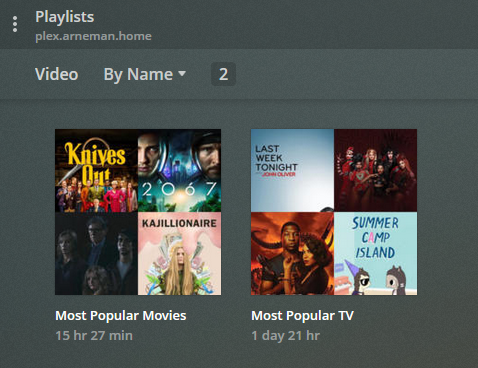

# Plex Top Playlist

This script is designed to run weekly, generating a playlist in Plex of most popular Movies and Television based on the data from the Tautulli API. It uses the [python-plexapi](https://github.com/pkkid/python-plexapi) package as well as [requests](http://python-requests.org/).



## Requirements

- Python
- [Plex](https://plex.tv)
- [Tautulli](https://github.com/Tautulli/Tautulli)

## Setup

```sh
cp config.ini.example config.ini
```

> Edit `config.ini` in your preferred text editor

```sh
pip install -r requirements.txt
python plextopplaylist.py
```
